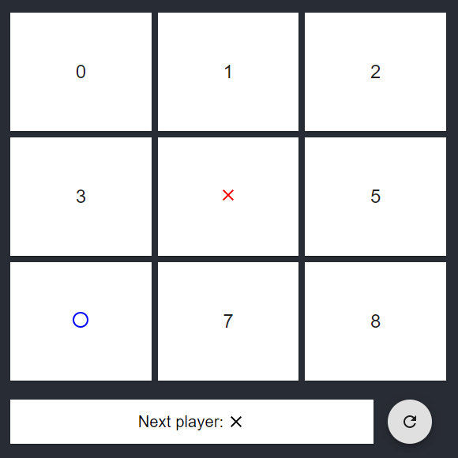
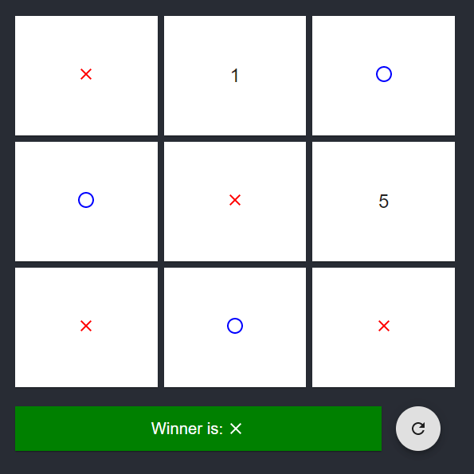

# Task 5 - Tic Tac Toe

_Created:_ **Matěj Tab**

#### Task 5.0

Your task for this lesson is to implement a simple Tic Tac Toe game by using basic concepts of React combined with the help of Material UI.

1. Complete the `Board` and `Square` components (`PlayerIcon` is optional)
1. Add calculate winner function (try to come up with a different solution than [here](https://reactjs.org/tutorial/tutorial.html#declaring-a-winner))
1. Add the `Status` component that shows which player's turn it is, shows winner info and contains the restart button

#### Conditions & Points

-   **1pt** for completing app's layout
-   **1pt** for correct functionality

#### Hints

-   all components can be implemented with just the suggested imports at the top and occasional `makeStyles` (keep it simple)
-   you can pass props to `useStyles` that you can then use in `makeStyles`
-   use `as const` to interpret static values as literal types

```ts
let foo = [1]; // type: number[]
let goo = [1] as const; // type: [1]
```

-   don't try to implement a pixel perfect recreation of provided example images
-   game in progress



-   game after player X won


